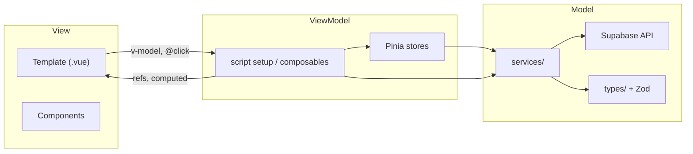

# Arquitectura — SGGD Frontend

## ¿MVC, MVVM u otro patrón?

### MVC (Model–View–Controller) — no recomendado aquí

MVC separa **Modelo**, **Vista** y **Controlador**. El controlador recibe la entrada del usuario, actualiza el modelo y elige qué vista renderizar.

Funciona bien en backends (Rails, Laravel, Spring) donde el servidor orquesta todo. En SPAs con Vue 3 **no encaja de forma natural** porque:

- No hay un "controlador" central por pantalla
- Vue ya une vista + lógica en el mismo componente (`.vue`)
- Forzar MVC genera capas artificiales (`controllers/LoginController.ts`) que solo delegan a Vue

### MVVM (Model–View–ViewModel) — patrón adoptado

Vue 3 con Composition API y Pinia implementa MVVM de forma nativa:



| Capa | Responsabilidad | En este proyecto |
|------|-----------------|------------------|
| **View** | Presentación, HTML, estilos, eventos de UI | `views/`, `components/`, `<template>` |
| **ViewModel** | Estado reactivo, lógica de pantalla, validación UI | `<script setup>`, `composables/`, `stores/` |
| **Model** | Datos, reglas de negocio, acceso a API | `services/`, `lib/`, `types/`, Supabase |

**Regla clave:** la View no llama a Supabase directamente (objetivo Fase 2). Solo el ViewModel/Model accede a datos.

### Clean Architecture / Hexagonal — complemento opcional

Para un proyecto escolar/MVP, MVVM es suficiente. Si el sistema crece (múltiples integraciones, reglas complejas), se puede añadir una capa `services/` con interfaces que desacoplen Supabase del resto — sin cambiar el patrón MVVM base.

## Estado actual (Fase 1)

```
src/
├── views/              → View (páginas)
├── components/         → View (UI)
├── lib/
│   ├── supabaseClient  → Model (cliente DB)
│   └── schema.ts       → Model (validación Zod)
├── utils/
│   └── cryptoUtils.ts  → Model (utilidad pura)
├── stores/             → ViewModel (vacío, pendiente Fase 2)
└── router/             → Navegación + guards
```

**Deuda conocida (Fase 2):**
- Llamadas a Supabase aún están en componentes/views (deben moverse a `services/`)
- Auth duplicada entre router, navbar y gestor de roles (unificar en `stores/auth.ts`)
- Tipos `Garantia`, `Perfil` repetidos en varios archivos (centralizar en `types/`)

## Flujo de datos recomendado

```
Usuario → View (click, input)
       → ViewModel (composable / store: valida, transforma)
       → Service (llama Supabase, maneja errores)
       → Model (DB via Supabase + RLS)
       ← respuesta
       ← ViewModel actualiza refs/computed
       ← View re-renderiza
```

## Ejemplo concreto: registro de garantía

**Hoy (Fase 1):**
```
RegistroForm.vue
  ├── ViewModel: refs, computed fechaVencimiento, validar()
  ├── Model: generarHashGarantia(), garantiaRegistroSchema
  └── ⚠️ supabase.from('garantias').insert() aún en el componente
```

**Objetivo (Fase 2):**
```
RegistroForm.vue (View)
  └── useRegistroGarantia() (ViewModel composable)
        └── garantiaService.crear() (Model/Service)
              └── supabase + Zod + cryptoUtils
```

## Seguridad

- **RLS en Supabase** es la línea de defensa real; el frontend solo oculta UI
- El hash de certificados se genera en cliente (aceptable para MVP escolar); migrar a Edge Function en producción
- Guards de router + navbar son UX, no seguridad

## Decisiones tomadas

1. **MVVM** como patrón principal — alineado con el ecosistema Vue
2. **No MVC** — evitar capa `controllers/` innecesaria
3. **Pinia** para estado global compartido (auth, sesión)
4. **Composables** para lógica reutilizable por pantalla
5. **Services** para toda comunicación con Supabase
6. **Zod** como fuente única de validación de formularios
